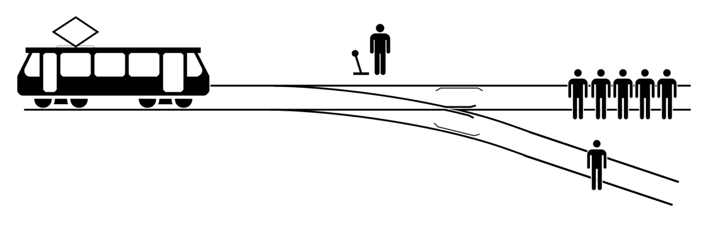

Contributor: Yuxin Liang, UNI: YL5140       


<br>

## Introduction

In this project, I aim to find the school that is most worthy to spend time studying of philosophy from the data set we have. Then I want to see which word is most likely to occur in this school. In order to find it, I want to ask myself which school last for the most years and which one has most authors contributed to it. By combining the results of the first two questions, I would find the union of the first five longest-duration and the most popular five schools. Then, I would clean the data to include only the union of the result schools. After that, I want to use the sentences provided to find what is the word that is most likely to be seen for each school respectively so that we can have a little more information about them.

<br>

## R-packages used
-- "tidyverse"        
-- "haven"        
-- "devtools"       
-- "RColorBrewer"       
-- "data.table"       
-- "ggplot2"        
-- "forcats"        
-- "vcd"        
-- "gridExtra"        
-- "HH"       
-- "GGally"       
-- "readr"        
-- "knitr"        
-- "markdown"       
-- "here"       
-- "dplyr" 
-- "stopwords"
-- "hcandersenr"
-- "tidytext"
```{r load libraries, warning=FALSE, message=FALSE, include=FALSE}
packages.used=as.list(
  c(
  "tidyverse",
  "haven",
  "devtools",
  "RColorBrewer",
  "data.table",
  "ggplot2",
  "forcats",
  "vcd",
  "gridExtra",
  "HH",
  "GGally",
  "readr",
  "knitr",
  "markdown",
  "here",
  "dplyr",
  "stopwords",
  "hcandersenr",
  "tidytext")
)
check.pkg = function(x){
  if(!require(x, character.only=T)) install.packages(x, 
                                                     character.only=T,
                                                     dependence=T)
}
lapply(packages.used, check.pkg)
```

<br>

## Data

The data I use is from Kaggle "History of Philosophy". It is formed by KOUROSH ALIZADEH, and has over 300,000 sentences from over 50 texts spanning 10 major schools of philosophy. It contains 11 columns and includes 10 major schools of philosophy, which are Plato, Aristotle, Rationalism, Empiricism, German Idealism, Communism, Capitalism, Phenomenology, Continental Philosophy, and Analytic Philosophy.\
Since the data is very likely cleaned by the author, I do not have the data pre-processing step.        
```{r read datasets, message=FALSE}
library(haven)
phi <- read_csv("../data/philosophy_data.csv")
```
<br>
-- This is the first five lines of the data set. This gives me a general idea of what is inside the data set.
```{r}
head(phi, 5)
```
<br>

## Questions


<br>

### 1. Which school exist for the longest time?

First, I want to see which school last for the longest time.        
To do that, I want to find the smallest year and maximum year for each school (use "original_publication_date") and then use subtraction to find the duration.       

```{r group by school, include=FALSE}
by.school <- phi %>% group_by(school)
```

```{r find the duration of each school, include=FALSE}
by.school1 <- by.school %>% summarise(
  min.year = min(original_publication_date),
  max.year = max(original_publication_date),
  dur = (max.year-min.year),
)
by.school1 <- by.school1 %>%
  ungroup() %>%
  arrange(desc(dur))
```

<br>
-- This is the plot of the duration of each school. As the plot shows the first five schools with longest duration are "Feminism", "Capitalism", "Empiricism", "Analytic", and "Rationalism". 
```{r polt duration}
ggplot(data=by.school1, aes(x=reorder(school,-dur), y=dur)) + 
  geom_bar(stat="identity", 
                 fill="steelblue")+
  labs(title="The duration of each school")+
  theme(axis.text.x = element_text(angle=45, hjust=0.9, size = 10))
```

<br>
-- After rearrange the data set in descending form, the first five schools in the data set matches my plot above. 
```{r see the result of duration}
head(by.school1,5)
```
<br>

### 2. Which school has most authors contributed to it?

Now, I want to see which school has most authors to decide if it is a popular one. I would choose the most three popular schools and compare the results with those of the previous one.

```{r find the number of authors in each school, include=FALSE}
by.school2 <- by.school %>% summarise(
  total.author=n(),.groups = 'drop'
)
by.school2 <- by.school2 %>%
  ungroup() %>%
  arrange(desc(total.author))
```
<br>
-- This is the plot of the total authors of each school. As the plot shows the first five schools with most authors are "Analytic", "Aristotle", "German_idealism", "Plato", and "Continental". 
```{r polt number of authors}
ggplot(data=by.school2, aes(x=reorder(school,-total.author), y=total.author)) + 
  geom_bar(stat="identity", 
                 fill="steelblue")+
  labs(title="The total number of authors of each school")+
  theme(axis.text.x = element_text(angle=45, hjust=0.9, size = 10))
```

<br>
-- After rearrange the data set in descending form, the first five schools in the data set matches my plot above. 
```{r see the result of authors}
head(by.school1,5)
```
<br>

### Analyze my first two results       
From what I got above        
-- The schools with longest duration are “Feminism”, “Capitalism”, “Empiricism”, “Analytic”, and “Rationalism”.        
-- The schools with most authors contributed to them are “Analytic”, “Aristotle”, “German_idealism”, “Plato”, and “Continental”.      
I want to find the overlap of the two results because that would be the schools with both long duration and a lot of authors. Therefore, those schools are the ones that people should pay more attention to.
As I presented, the only school that exist in both sets is "Analytic". Therefore, I would use only data of "Analytic" in my next question to find the word that is most likely to present in this school.

<br>

### 3. Among the school that is most study-worthy, what are words that are most likely to appear?

After I find the school that I want to focus on, I want to see the mostly appeared word. To do that, I would first select needed data from the data set. Then I will remove stop words from the sentences in the data and then find out the first five mostly occurred words.       

```{r select needed data, include=FALSE}
phi.ana <- phi[phi$school == 'analytic',]
phi.ana <- phi.ana %>% dplyr::select(sentence_str)
```

```{r remove stop words, include=FALSE}
library(stopwords)
library(hcandersenr)
library(tidyverse)
library(tidytext)
phi.ana.tok <- phi.ana %>%
  unnest_tokens(word, sentence_str)

phi.ana.tok <- phi.ana.tok %>%
  filter(!(word %in% stopwords("en",source = "stopwords-iso")))
```
<br>
-- As shown below, the first five words that are most frequently occurred are "true", "sense", "theory", "language" and "time".
```{r find five most frequent words}
words <- sort(table(phi.ana.tok),decreasing=TRUE)
head(words,5)
```

<br>

## Conclusion


<br>
After I carefully examine the data set, I answered my three questions. The five schools with longest duration are “Feminism”, “Capitalism”, “Empiricism”, “Analytic”, and “Rationalism”. Meanwhile, the five schools with the largest number of authors are “Analytic”, “Aristotle”, “German_idealism”, “Plato”, and “Continental”. I want to find the overlap of the two results because this school should be the most time-worthy one. \
I first thought that the two sets of first two answers would have a larger overlap, but the result is different from what I imagined. There is only one element in the union of two sets, which is "Analytic" philosophy, so this would be the one we spend most time studying. To know more about this school, I further examine this school's sentences and find out that the five words that mostly appear in this school are "true", "sense", "theory", "language" and "time".


